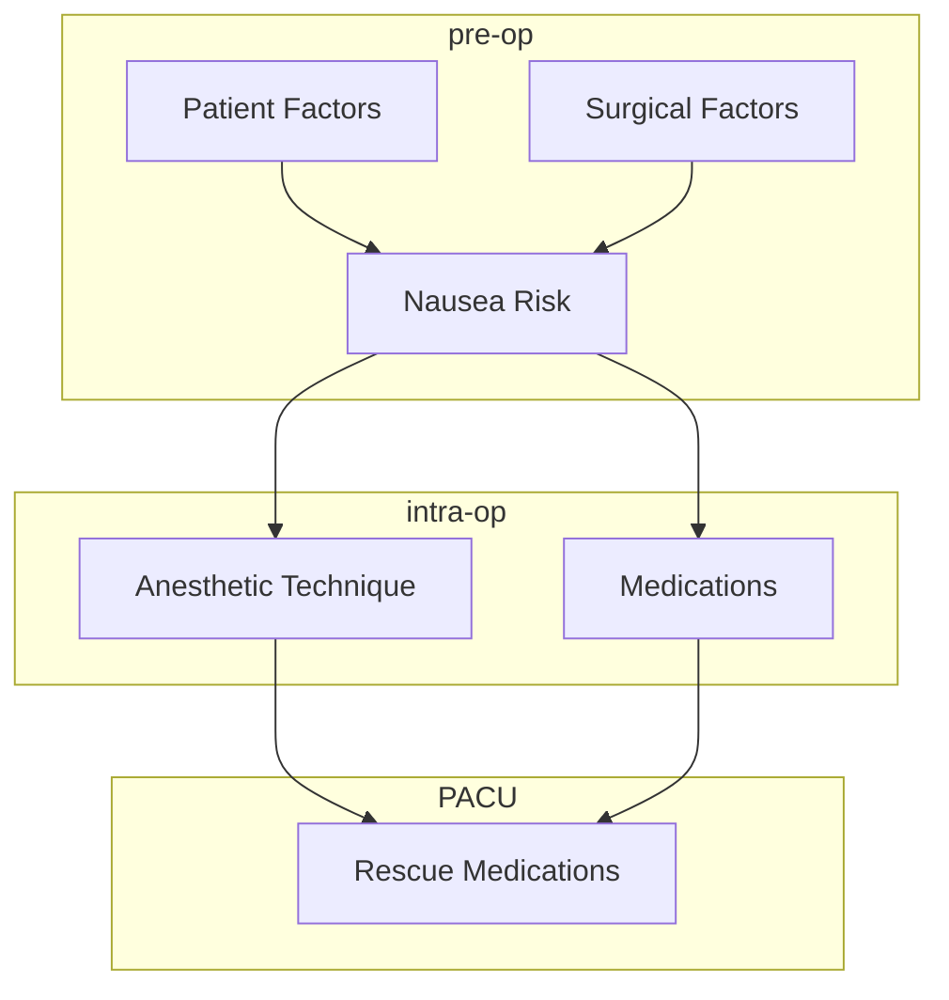

# Welcome
This website is part of a University of Calgary Educational Scholarship study to evaluate learning resources for medical students through anesthesia.

# Goal
The goal of this project is to provide condense, useful educational resources that can be used during anesthesia rotations and beyond. 

Several formats of resources exist, including clinical practice flowcharts, topic pocket cards, and a pharmacy section.

