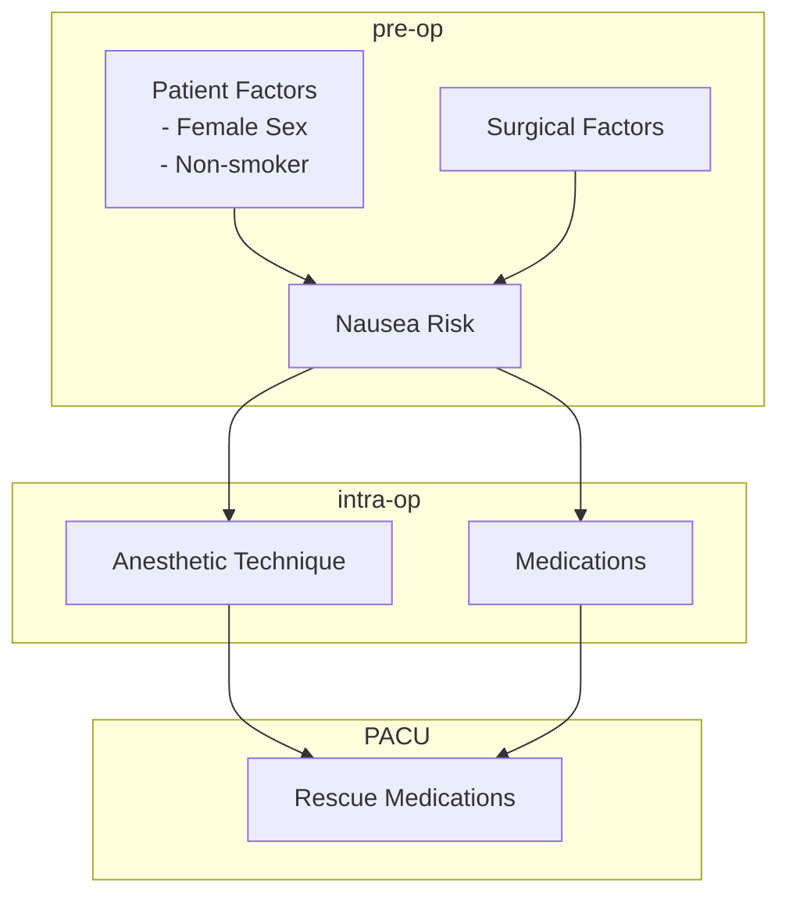

The following topics are taken from the Anesthesia Clerkship Core Documents. The following collection can serve as memory aids for some key topics, but does not include an exhaustive overview.

### Intra-operative Monitoring
### Fluid Management
### Physiology
### Pharmacology
### Airway Mechanical Skills
### Ventilation Management
### Pain Management
[[Pain Management]]
### Pre-operative Evaluation
[[Airway Assessment Pocket Card]]
### Post-operative Management

Testers

