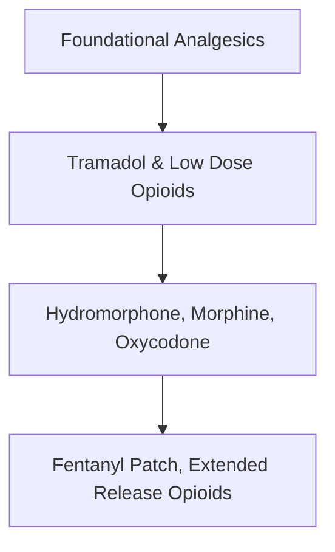

# Introduction
Pain management can be a complex topic in anesthesia. Patient factors, like age, comorbidities, and pre-existing chronic pain can help guide analgesia during the operative period. Surgical factors, like the expected intra-operative and post-operative pain can also help determine which agents to use and in what dosage.
# Definitions
1. Multimodal Analgesia - use of different classes of drugs to optimize analgesia while minimizing individual drug side-effects

# WHO Pain Ladder
The classic WHO pain ladder can be a useful reference when considering pain management in any patient.

# Analgesia Overview
## Maximize Non-opioid Analgesia
Consider pre-operative [[Acetaminophen]]
Consider the use of [[NSAID]]s, but this will depend on the type of surgery. Generally, NSAIDs are given at the end of an operation if hemostasis is adequate and concerns of bleeding are low.
 - Ibuprofen
 -  [[Ketorolac]]
## Opioids
Opioids are the workhorse of analgesia in the perioperative period. Each of the opioids has a different onset of action and duration of action. The degree of analgesia (determined by the choice and dose of opioid) should be matched to the expected stimulus of the operations.

For instance, [[Remifentanil]] is a good choice in operations that have brief, potent stimulation but minimal post-operative pain. 

[[Hydromorphone]] and [[Morphine]] are good choices when there is intra-operative and post-operative pain.

[[Tramadol]] can be used after surgery and is commonly prescribed because it does not require a triplicate.

## Multimodal Analgesia
There are a variety of co-analgesic options that can be infused or bolused throughout the operation. A few options include:
1. [[Ketamine]]
2. Lidocaine
3. Dexmedetomidine
4. Magnesium

## Regional Anesthesia
Depending on the operation, there are a variety of single shot and catheter based regional techniques that can provide intra-operative and post-operative pain control. A few options include:
1. Spinal anesthesia -- used commonly in c-secitons
2. Epidural anesthesia -- used in labouring patients and laparotomies
3. Adductor canal nerve blocks -- used in some knee and lower extremity surgeries
4. Interscalene nerve block -- can be useful for surgery surgery

[^1]:
[^2]:
[^3]:
[^4]: