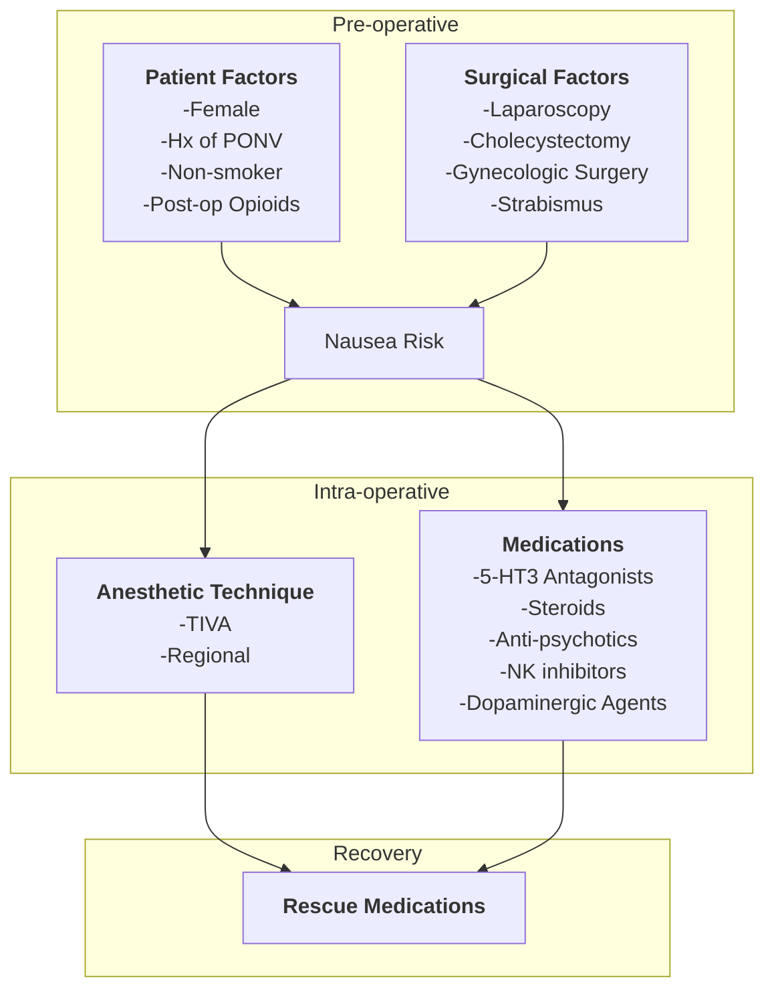
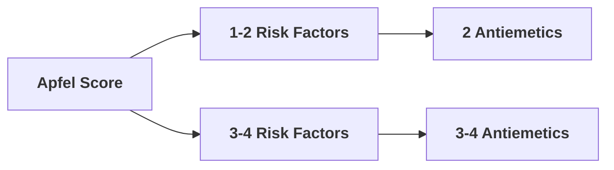

# General Principles
- Many patients undergoing anesthesia will experience post-operative nausea and vomiting
- Anti-emetic medications are given routinely during anesthesia. 
- Combining agents of different classes reduces side effects and improves anti-emetic action

# Clinical Pathway

# Risk Factors for Nausea
## Patient Risk Factors -- Apfel Score [^1]
- Female
- Non-smoker
- history of PONV/motion sickness
- post-operative opioids

| Apfel Score Points | Risk of PONV |
|--------------------|--------------|
| 0                  | 10%          |
| 1                  | 20%          |
| 2                  | 40%          |
| 3                  | 60%          |
| 4                  | 80%          |

## Surgical Risk Factors
- Cholecystectomy
- laparoscopic
- gynecologic

## Anesthetic Risk Factors
 - Duration of anesthesia
 - use of volatile anesthetics / nitrous oxide

# Medications to Prevent PONV

## 5-HT3 Antagonists
[[Ondansetron]]

## Antidopaminergics
[[Haloperidol]]
[[Metoclopromide]]

## NK1 Receptor Antagonists
[[Aprepitant]]

## Corticosteroids
[[Dexamethasone]]

[^1]:  [[Tong J. Gan, Kumar G. Belani, Sergio Bergese, Frances Chung, Pierre Diemunsch, Ashraf S. Habib, Zhaosheng Jin, Anthony L. Kovac, Tricia A. Meyer, Richard D. Urman, Christian C. Apfel, Sabry Ayad, Linda Beagley, Keith Candiotti, Marina Englesakis, Traci L. Hedrick, Peter Kranke, Samuel Lee, Daniel Lipman, Harold S. Minkowitz, John Morton, Beverly K. Philip. 2020. Fourth Consensus Guidelines for the Management of Postoperative Nausea and Vomiting . 411-448]]
[^2]:
[^3]:
[^4]: