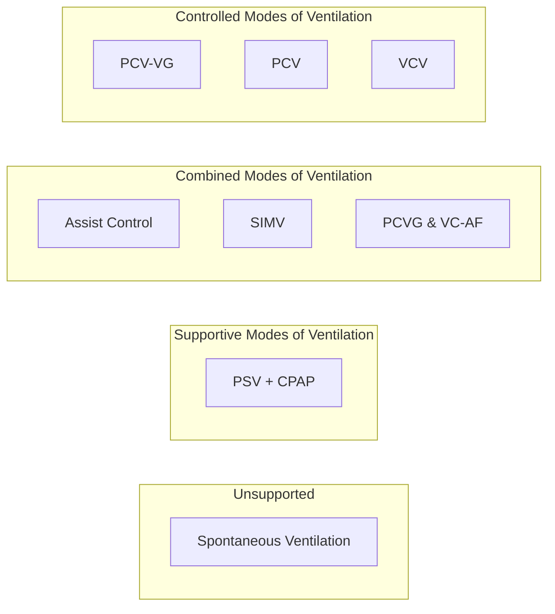

# Ventilator Basics
*There are a variety of methods to ventilate patients in the OR once an [[Airway Devices|Airway]] is placed. As the name suggests, controlled modes of ventilation allow the anesthesiologist to set ventilator parameters which will be delivered to the patient. These modes are best if the patient is not interacting with the ventilator (paralyzed, deep anesthetic, strong analgesia). Supportive modes can augment patient's ventilatory efforts which can be useful in unparalyzed patients or those weaning from the ventilator. Spontaneous modes of ventilation require the patient to provide all of the ventilatory work (with the exception of some CPAP).*

## Terminology
- **FiO2**
	- The concentration of oxygen within the circuit

- **Respiratory Rate (RR)**
	- Number of breaths per minute
	- Set by patient or doctor

- **Tidal Volume (Vt)**
  - Volume of air per breath
  - Based on patient’s ideal body weight, generally targeted at 6-8 cc/kg

- **Mean Airway Pressure (MAP)**
  - Average pressure in airways during respiratory cycle

- **Driving Pressure**
  - Difference between plateau pressure and PEEP
  - Reflects pressure to overcome lung and chest wall resistance

- **PEEP (Positive End-Expiratory Pressure)**
  - Pressure maintained in lungs at the end of expiration
  - Prevents alveolar collapse
  
- **CPAP (Continuous Positive Airway Pressure)**
  - Constant positive pressure in airways
  - Keeps airways open
  - Improves oxygenation

- **Compliance**
	- The amount of tidal volume delivered for a given driving pressure
	- $Compliance = \frac{Tidal~Volume}{Driving~Pressure}$

- **Plateau Pressure**
	- Pressure applied by the ventilator at the end of inspiration 
	- Reflects the pressure in the small airways and alveoli

# Ventilator Modes

# Controlled Modes of Ventilation
*controlled modes do not do well when a patient tries to draw a breath*
## Volume Control
- tidal volume, respiratory rate, PEEP, FiO2 are set
- ventilator calculates the inspiratory/expiratory time based on respiratory rate
- constant *flow* is delivered during a breath
- airway pressure will vary based on the patient's compliance

## Volume Control - Autoflow [^2]
- Appears in Draager machines. Autoflow is available in all ventilator modes but commonly appears in volume control on local machines.
- delivers a *decelerating flow* similar to pressure control ventilation
- tidal volume, respiratory rate, PEEP, FiO2 are set
- ventilator calculates the inspiratory/expiratory time based on respiratory rate
- airway pressure will still vary based on the patient's compliance

## Pressure Control
- driving pressure, respiratory rate, PEEP, FiO2 are set
- ventilator delivers a breath until flow slows down (~20% peak inspiratory flow)
- constant *pressure* is delivered during a breath
- airway pressure will vary based on the patient's compliance

## Pressure Control Volume Guarantee [^1]
*tries to maintain the benefits of pressure control ventilation while allowing the doctor to choose the tidal volume and respiratory rate*
- tidal volume, respiratory rate, PEEP, FiO2 are set
- breaths are given in a pressure controlled manner
	- the pressure of a breath is determined by the patient's compliance, and the ventilator will try to pressure that achieves the set tidal volume
- 
# Assisted Modes of Ventilation
*Used when the patient can interact with the ventilator*

Requires:
- ventilatory drive
- incomplete paralysis

## Assist Control Volume Control
*Each triggered breath receives a full breath*
- tidal volume, respiratory rate, PEEP, FiO2 are set
- if the patient triggers a breath above the set respiratory rate, a **full** breath will be delivered
- ventilator calculates the inspiratory/expiratory time based on respiratory rate
- constant *flow* is delivered during a breath
- airway pressure will vary based on the patient's compliance

## Assist Control Pressure Control
*Each triggered breath receives a full breath*
- driving pressure, respiratory rate, PEEP, FiO2 are set
- if the patient triggers a breath above the set respiratory rate, a **full** breath will be delivered
- ventilator delivers a breath until flow slows down (~20% peak inspiratory flow)
- constant *flow* is delivered during a breath
- airway pressure will vary based on the patient's compliance

## SIMV modes
*SIMV is a mode for weaning patients from the ventilator. Each time the patient triggers the ventilator, they receive a supported breath (vs a full breath in assist control). This can be useful because triggered breaths can be quite different than mandatory breaths.*

Requires:
- ventilatory drive
- incomplete paralysis

# Manual/Spontaneous Modes
- No inspiratory pressure is delivered
- CPAP can be delivered to prevent atelectasis

[^1]: https://www.gehealthcare.com/en-my/-/jssmedia/global/products/files/anesthesia-delivery/pressure-control-ventilation-volume-guaranteed.pdf?rev=-1
[^2]: https://www.draeger.com/Content/Documents/Products/autoflow-bk-9066357-en.pdf
[^3]:
[^4]: